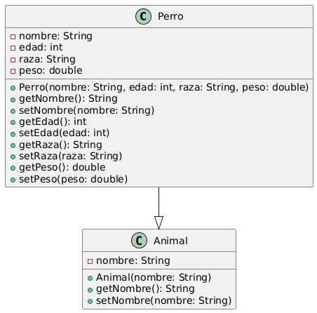

## Hola
### Holita
-----

H~2~O

---

##como estas?

1. Hoy
2. Mañana
3. Ahora

- [x] Bien 
- [ ] Mal
- [ ] Normal

- SSSS
- llll
- FFFF
---

:joy:

*Texto inclinado*

`code`

### My Great Heading {#custom-id}

----

# Tablita Ejemplo

|Producto |Cantidad|Precio|
|---------|--------|------|
| Papa    | 24     |2.200 |
| Arroz   | 56     |4.500 |
| Naranjas| 12     |2.900 |
| Manzanas| 2      |4.500 |
| Peras   | 3      |3.600 |
| Uva     | 44     |4.500 |
| Leche   | 23     |3.600 |
| Lentejas| 95     |4.500 |

**Promedio:** 53.422

------


---

 <Style>
        table {
  border-collapse: collapse;
  border: 2px solid rgb(124, 31, 133);
  font-family: sans-serif;
  font-size: 0.8rem;
  letter-spacing: 1px;
}

caption {
  caption-side: bottom;
  padding: 10px;
  font-weight: bold;
}

thead,
tfoot {
  background-color: rgb(228 240 245);
}

th,
td {
  border: 1px solid rgb(160, 160, 160);
  padding: 8px 10px;
}

td:last-of-type {
  text-align: center;
}

tbody > tr:nth-of-type(even) {
  background-color: rgb(156, 233, 233);
}

tfoot th {
  text-align: right;
}

tfoot td {
  font-weight: bold;
}

    </Style>
 <table>
        <caption>
          Tablita bonita
        </caption>
        <thead>
          <tr>
            <th scope="col">Producto</th>
            <th scope="col">Cantidad</th>
            <th scope="col">Precio</th>
          </tr>
        </thead>
        <tbody>
          <tr>
            <th scope="row">Papa</th>
            <td>24</td>
            <td>2.200</td>
          </tr>
          <tr>
            <th scope="row">Arroz</th>
            <td>56</td>
            <td>4.500</td>
          </tr>
          <tr>
            <th scope="row">Naranjas</th>
            <td>12</td>
            <td>2.900</td>
          </tr>
          <tr>
            <th scope="row">Manzanas</th>
            <td>2</td>
            <td>4.500</td>
          </tr>
          <tr>
            <th scope="row">Peras</th>
            <td>3</td>
            <td>3.600</td>
          </tr>
          <tr>
            <th scope="row">Uva</th>
            <td>44</td>
            <td>4.500</td>
          </tr>
          <tr>
            <th scope="row">Leche</th>
            <td>23</td>
            <td>3.600</td>
          </tr>
          <tr>
            <th scope="row">Lentejas</th>
            <td>95</td>
            <td>4.500</td>
          </tr>
        </tbody>
        <tfoot>
          <tr>
            <th scope="row" colspan="2">Promedio</th>
            <td>53.422</td>
          </tr>
        </tfoot>
        
      </table>

    
----
##Clase java herencia y encapsulamiento



```Java

public class Perro extends Animal {
  private int edad;
  public String raza;
  private double peso;

  public Perro(String nombre, int edad, String raza, double peso) {
    super(nombre);
    this.nombre = nombre;
    this.edad = edad;
    this.raza = raza;
    this.peso = peso;

  }

  public String getNombre() {
    return nombre;
  }

  public void setNombre(String nombre) {
    this.nombre = nombre;
  }

  public int getEdad() {
    return edad;
  }

  public void setEdad(int edad) {
    this.edad = edad;
  }

  public String getRaza() {
    return raza;
  }

  public void setRaza(String raza) {
    this.raza = raza;
  }

  public double getPeso() {
    return peso;
  }

  public void setPeso(double peso) {
    this.peso = peso;
  }

}

```